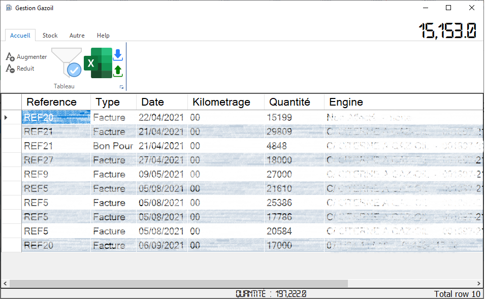
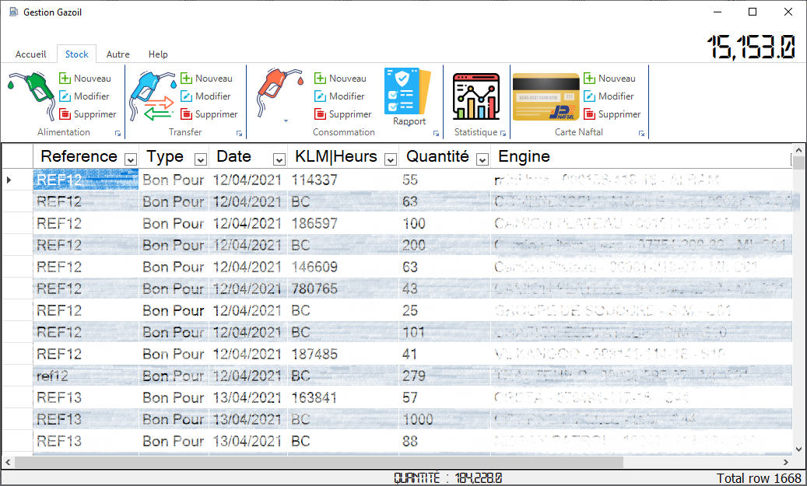

# GGAO 
Gestion Gasoil Assité par ordinateur : est un application desktop pour la Gestion du gas oil 
qui peut aider peut aider à suivre le stock en fournissant plusieurs fonctionnalités.
Parmi les fonctionnalité :

* Stock detaillé (les entrées, les sorties)
* Gestion Plusieure type des produits
* Gestion les mouvements des produits 
(les depots, les Transpourteurs ou les moyens de transport)
* Filtrer l'affichage pour obtenir tout de suite des informations
* Simple pour immigrer de et à cette application par d'importation ou exportation des données
* Impression des rapports quotidienne ou mensuelle
* Visualisé des Courbes de Consommation des produits

Prerequisite
------------
* .NET Framework 4.5
* SQL Server 2016 Express local DB

Screenshot
----------

Credit
----------
 images used in this app from :
 * freepik
 * flaticon
 * pichon
Enjoy.
